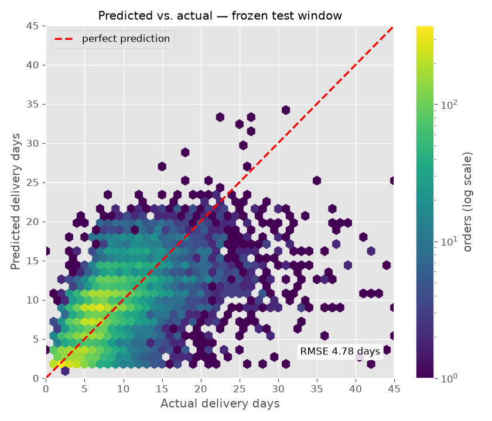
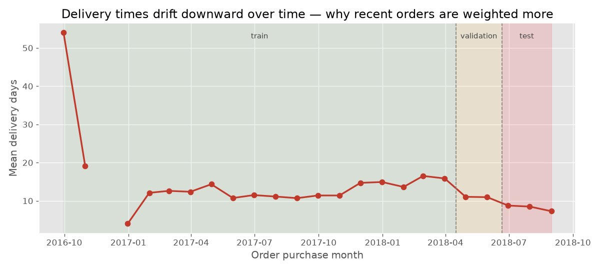

# Smart Shipping Optimizer

Predicts order **delivery time** (in days) for a Brazilian e-commerce marketplace, using
the public [Olist dataset](https://www.kaggle.com/datasets/olistbr/brazilian-ecommerce).
It joins orders, items, products, sellers, customers, payments, reviews, and geolocation
data, then trains an XGBoost regression model — evaluated honestly on a **time-based**
held-out test set, with no data leakage.

## Results

Scored on a test window that was frozen from the start and measured **exactly once**, after
every decision was final (see [How performance was measured](#how-performance-was-measured)):

| Predictor | Test RMSE | MAE | P90 abs. err. | Late rate | R² |
|-----------|-----------|-----|---------------|-----------|-----|
| Naive baseline (predict the training mean) | 7.35 days | 6.32 | 10.82 | 13.6% | — |
| Olist's own delivery estimate | 13.19 days | 10.80 | 21.00 | 5.7% | — |
| **XGBoost (tuned)** | **4.75 days** | **3.15** | **6.42** | 41.4% | +0.24 |

On the never-tuned-on test window the model cuts the naive-baseline RMSE by **~35%** and beats
Olist's own delivery estimate by **~64%**. The absolute error is *lower* than on validation
(6.23 RMSE) mainly because delivery times drift — the most recent orders (the test window) are
faster and less dispersed, so there's simply less error to make, which also drags R² down (less
variance to explain), rather than the model suddenly generalizing better. "Late rate" is the
share of orders that arrive *after* the prediction; because the point model targets the mean,
~40% run late by design — which is exactly why a separate promise model exists.

**Delivery promises (P90 model).** A mean estimate is the wrong product for an "arrives by"
promise. A second model, trained on the 0.9 pinball loss, answers *"90% of orders arrive by day
X"*: on the frozen test window it covers **92.3%** of orders with an average promise of **14.5
days** — tighter than Olist's own 18.1-day average estimate, while still keeping the promise.



*Predictions vs. truth on the never-tuned-on test window. The mass sits along the diagonal;
the model regresses toward the mean at the extremes — over-predicting the very fastest orders,
under-predicting the slowest — the honest signature of a squared-error model. (Shown RMSE 4.78
is one retrain; the 4.75 headline is the same model within run-to-run search noise.)*

The full modeling record — including experiments that were **rejected** and logged anyway (e.g.
early stopping, which fought the recency weighting, and ~20 candidate features dropped as
redundant) — is in `analysis/feature_engineering.ipynb`.

### How performance was measured

An earlier version of this project chose its features and hyperparameters by measuring on the
test set, so its headline number (5.47 RMSE) was optimistic — the model had, indirectly,
already seen the data it was graded on. This version uses a strict **three-way chronological
split**: earliest **70%** train, next **15%** validation, latest **15%** test.

- **Every** keep/drop and tuning decision is made on the **validation** window.
- The **test** window stays frozen and is scored **exactly once**, at the very end, after all
  decisions are final — and whatever it reports is what's in the table above, better or worse.
- The shipped model is then retrained on train + validation combined (all history before the
  test window), which is what a deployed model would actually use.



*Why the split has to be chronological — and why recent orders are weighted more. Delivery
times fall steadily across the data window, so the training period describes a slower
marketplace than the one being predicted. This drift is what recency weighting (PR 13.1)
counters, and it's also why the test window's naive baseline (7.35) is lower than
validation's (8.27).*

The old 5.47 isn't comparable to the 4.75 here — it came from a different, since-replaced
pipeline *and* a contaminated measurement. The point of this rework was not to beat it, but to
produce a number that can be trusted.

### Key modeling decisions
- **Target:** actual delivery time (`order_delivered_customer_date − order_purchase_timestamp`),
  *not* the platform's own estimate (which is what an earlier version leaked). Trained on
  `log1p(days)` to tame the long right tail of slow deliveries, then inverted with `expm1`.
- **Split:** time-based 70% train / 15% validation / 15% test so the model is judged on
  forecasting the future, never on peeking at it. CV uses `TimeSeriesSplit`.
- **Features:** a compact, validated set — Olist's promised delivery window, purchase-month
  seasonality, raw coordinates + zip prefixes, order economics/size, and leak-safe historical
  averages per seller-zip and per shipping route (each row sees only orders that *completed*
  before it was placed). Distance, region, order-size, category, and seller-behaviour features
  were all measured and dropped as redundant.
- **Drift handling:** deliveries got faster over 2016→2018, so training rows are **recency-
  weighted** (weight halves every 60 days into the past); the half-life is chosen on validation.
- **Encoding:** state / route target encoding is refit *inside* the CV pipeline (per fold) so it
  can't leak. No feature scaling — trees are scale-invariant.
- **Tuning:** `RandomizedSearchCV` over a `TimeSeriesSplit`, not hardcoded guesses.
- **Promise model:** a second XGBoost trained on the 0.9 quantile (pinball) loss produces the
  customer-facing "arrives by" date, reported with its empirical coverage.

## Project layout

| Path | Purpose |
|------|---------|
| `logistics.py` | **Main pipeline** — loads data, engineers features, tunes + trains the XGBoost model, evaluates it (time-aware CV + held-out test), and saves the model to `models/`. |
| `utils.py` | Shared helpers — cached `load_data()`, vectorized `haversine()`, region/category lookups. |
| `analysis/feature_engineering.ipynb` | Feature-engineering lab notebook, incl. the experiment log of what was tried and rejected. |
| `analysis/correlation.py` | Exploratory analysis — correlations, plots, shipping-corridor network graph, PCA, residuals. |
| `analysis/featurevisual.py` | Feature screening — ranks candidate features by correlation with delivery time. |
| `experiments/` | Scratch / experimental work (not part of the pipeline). |
| `data/` | Olist CSVs (not tracked in git). |
| `models/` | Saved model artifacts (not tracked in git). |

## Requirements

- Python 3.12
- Dependencies listed in `requirements.txt`

## Setup

```bash
# 1. Create and activate a virtual environment
python -m venv venv
# Windows (PowerShell):
venv\Scripts\Activate.ps1
# macOS / Linux:
source venv/bin/activate

# 2. Install dependencies
pip install -r requirements.txt
```

## Data

The Olist CSV files are expected in the `data/` folder:

```
data/
├── olist_orders_dataset.csv
├── olist_order_items_dataset.csv
├── olist_order_payments_dataset.csv
├── olist_order_reviews_dataset.csv
├── olist_products_dataset.csv
├── olist_sellers_dataset.csv
├── olist_customers_dataset.csv
├── olist_geolocation_dataset.csv
└── product_category_name_translation.csv
```

If they are missing, download the dataset from
[Kaggle](https://www.kaggle.com/datasets/olistbr/brazilian-ecommerce) and place the CSVs
in `data/`. The first run builds a cached `data/_cache.parquet` to speed up later runs
(delete it to force a rebuild).

## Usage

Train, tune, and evaluate the model (the main entry point):

```bash
python logistics.py
```

This runs the hyperparameter search, prints the chosen params and cross-validation RMSE, scores
the validation window (where all decisions are made), then retrains on train+validation and
scores the frozen test window once — each as a metric panel (RMSE / MAE / median / P90 / late
rate) next to the naive baseline and Olist's own estimate, plus the P90 promise model's
coverage. It saves a portable model artifact (point model + promise model) to `models/` as
four files: two XGBoost-JSON boosters, a joblib preprocessing bundle, and a human-readable
`.meta.json` sidecar (metrics, params, feature schema).

Score orders with the saved model:

```bash
python predict.py --demo            # score 5 rows from the frozen test window
python predict.py --csv orders.csv  # score your own order-grain CSV
```

`predict.py` loads the newest artifact from `models/`, rebuilds the features, and prints the
predicted delivery days alongside the P90 "arrives by" promise (and, in `--demo`, the actual
delivery time and whether the promise held).

Run the test suite:

```bash
pytest
```

Run the exploratory analysis (opens matplotlib plots):

```bash
python analysis/correlation.py
python analysis/featurevisual.py
```
